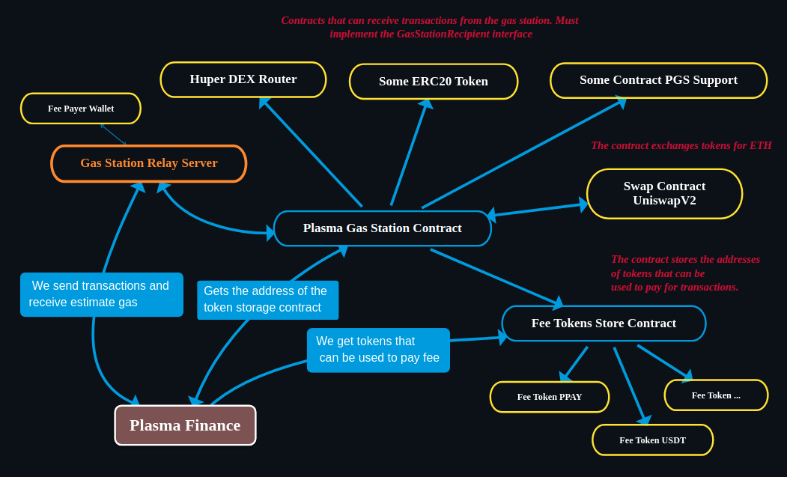

# Plasma Gas Station Relay Server.
The relay server pays for gas for the user's transaction, takes ERC 20 tokens.

### Work Flow Schema:


### Prerequisites
To build and run this project you need to have the following installed on your system:
- Node.js (v14.17.3 or above) – [How to install Node.js](https://nodejs.org/en/download/)
- Docker (v19.03.8 or above) – (Optional) [How to install Docker](https://docs.docker.com/engine/install/)
- Docker Compose (v1.25.4 or above) – (Optional) [How to install Docker Compose](https://docs.docker.com/compose/install/)

### Environment variables
#### Server settings:
- **LOG_LEVEL** - Enum *error*, *warn*, *info* or *debug*. By default used *debug*.
- **NODE_ENV** - By default *development*.
- **PORT** - Server listen port. By default 3000.
- **CORS_CREDENTIALS** - Configures the Access-Control-Allow-Credentials CORS header. Set to true to pass the header, otherwise it is omitted. By default - *false*.
- **CORS_ORIGIN** - Configures the Access-Control-Allow-Origin CORS header. If set origin to a specific origin. For example if you set it to "http://example.com" only requests from "http://example.com" will be allowed.
#### Chain settings:
- **RPC_URL** - (Required) The URL to a node on the network you wish to use. If you do not know what to put here, get a free [Infura account](https://infura.io/), create a project, and look at KEYS > ENDPOINTS for your network. Use the endpoint that starts with https://
- **FEE_PAYER_WALLET_KEY** - (Required) The private key of the wallet from which the transaction fee will be paid. And where the bonus will be credited for relaying  the transaction. There should be a positive ETH balance.
- **GAS_STATION_CONTRACT_ADDRESS** - (Required) The address of the contract that performs the transaction. The whole logic of the fee calculation, signature verification, execution of a user transaction.
#### Gas price settings:
- **DEFAULT_FEE_PER_GAS** - The default priority fee for EIP-1559 or the gas price for legacy, in WEI. By default: *3000000000*.

### Development
Before starting the server, you need to create a .env file and add the required environment variables there:
```dotenv
RPC_URL=https://kovan.infura.io/v3/{{API_KEY}}
FEE_PAYER_WALLET_KEY=0x....
GAS_STATION_CONTRACT_ADDRESS=0xE70F0579DB25f037F6CBe48080224a58C5E6f695
```
To start the server, use the following commands:
```
npm run dev
```
or
```
npm run dev:watch
```
### Build Production
For build server use the command:
```
npm run build
```
For build server and build docker image use the command:
```
npm run build:docker
```
To change the project version, use the command:
```
npm run bump
```
### Docker Compose
```yaml
version: '3'

services:
  relay:
    image: sergeyitsib/gas-station-relay:latest
    restart: always
    environment:
      PORT: '3200'
      CORS_ORIGIN: '*'
      RPC_URL: 'https://kovan.infura.io/v3/{{INFURA_API_KEY}}'
      FEE_PAYER_WALLET_KEY: '0x....'
      GAS_STATION_CONTRACT_ADDRESS: ''
    ports:
      - '3200:3200'
```
